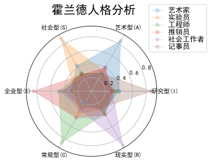

## week9 pyhon计算生态概览
### 9.1 从数据处理到人工智能
### 9.2 霍兰德人格分析雷达图
### 9.3 从web解析到网络空间
### 9.4 从人机交互到艺术设计
### 9.5 实例16：玫瑰花绘制

### 9.1 从数据处理到人工智能
- 数据分析：
- 最基础的库是Numpy（c语言实现，python接口，速度快），是其他众多数据分析库的基础，表达N维数组的最基础库
- Pandas：数据分析高层次应用，提供了简单易用的数据结构分析工具，理解数据类型与数据索引的关系，操作索引及操作数据
    - series=索引+一维数组
    - DataFrame=行列索引+二维数据
- Scipy：提供了一批数学算法及工程数据运算功能，类似matlab，用于数学科学计算

    - 数据表示
    - 数据清洗
    - 数据统计
- 数据可视化：
    - Matplotlib:高质量二维数据可视化功能库，基于Numpy开发
        - 有超过100种数据可视化展示效果
        - 通过matplotlib.pyplot库调用各种可视化效果
    - Seaborn：统计类数据可视化功能库
        - 提供了一批高层次的统计类数据可视化展示效果
        - 主要展示数据间的分布、分类和线性关系等内容
        - 基于Matplotlib开发，支持Numpy和Pandas
    - Mayavi：提供了一批简单易用的3D科学计算数据可视化展示效果
        - 三维科学可视化的主要库
    - 数据挖掘
    - 人工智能
- 文本处理：
    - PyPDF2：用来处理PDF文件的工具集
        - 支持获取信息、分隔/整合文件、加密解密等
        - 完全python语言实现，无需额外依赖，功能稳定
    - NLTK：自然语言处理的第三方库
        - 提供了简单易用的自然语言文本的处理功能
        - 语言文本分类、标记、语法句法、语义分析等
    - Python-docx：创建或更新Microsoft Word文件的第三方库
        - 增加配置段落、图片、表格、文字等，功能全面
- 机器学习：
    - Scukit-learn：机器学习方法工具集
        - 提供一批统一化的机器学习方法共能接口
        - 提供据类、分类、回归、强化学习等计算功能
        - 机器学习最基本且最优秀的Python第三方库
    - Tensorflow：AlphaGo背后的机器学习计算框架
        - 谷歌公司推动的开源机器学习框架
        - 将数据流图为基础，图节点代表运算，边代表张量
    - 深度学习：
        - MXNet：基于神经网络的深度学习计算框架
        - 可用于自动驾驶、机器翻译、语音识别等众多领域

### 9.2 霍兰德人格分析雷达图
- 霍兰德人格分析：
    - 霍兰德认为：人格兴趣与职业之间有一种内在联系
- 需求：以雷达图方式验证霍兰德人格分析
- 输入：各职业人群兴趣的调研数据
- 输出：雷达图


```python
#HollandRadarDraw
import numpy as np
import matplotlib.pyplot as plt
import matplotlib
matplotlib.rcParams['font.family']='SimHei'
radar_labels = np.array(['研究型(I)','艺术型(A)','社会型(S)',\
                         '企业型(E)','常规型(C)','现实型(R)']) #雷达标签
nAttr = 6
data = np.array([[0.40, 0.32, 0.35, 0.30, 0.30, 0.88],
                 [0.85, 0.35, 0.30, 0.40, 0.40, 0.30],
                 [0.43, 0.89, 0.30, 0.28, 0.22, 0.30],
                 [0.30, 0.25, 0.48, 0.85, 0.45, 0.40],
                 [0.20, 0.38, 0.87, 0.45, 0.32, 0.28],
                 [0.34, 0.31, 0.38, 0.40, 0.92, 0.28]]) #数据值
data_labels = ('艺术家', '实验员', '工程师', '推销员', '社会工作者','记事员')
angles = np.linspace(0, 2*np.pi, nAttr, endpoint=False)
data = np.concatenate((data, [data[0]]))
angles = np.concatenate((angles, [angles[0]]))
fig = plt.figure(facecolor="white")
plt.subplot(111, polar=True)
plt.plot(angles,data,'o-', linewidth=1, alpha=0.2)
plt.fill(angles,data, alpha=0.25)
plt.thetagrids(angles*180/np.pi, radar_labels)
plt.figtext(0.52, 0.95, '霍兰德人格分析', ha='center', size=20)
legend = plt.legend(data_labels, loc=(0.94, 0.80), labelspacing=0.1)
plt.setp(legend.get_texts(), fontsize='large')
plt.grid(True)
plt.savefig('holland_radar.jpg')
plt.show()
```





### 9.3 从web解析到网络空间
- 网络爬虫：使用程序爬网站信息
    - Requests：最友好的网络爬虫功能库
        - 提供了简单易用的类HTTP协议网络爬虫功能
        - 支持连接池、SSL、 Cookies、HTTP(s)代理等
        - python最主要的页面级爬虫工具
    - Scrapy：优秀的网络爬虫框架
        - 提供了构建网络爬虫系统的框架功能，功能半成品
        - 支持批量和定时网页爬取、提供数据处理流程
        - Python最专业的网页爬虫
    - pyspider：强大的Web页面爬取系统
        - 提供了完整的网页爬取系统构建功能
        - 支持数据库后端、消息队列、优先级、分布式架构等
- Web信息提取
    - Beautiful Soup:HTML和XML解析库
        - 可以加载多种搜索引擎
        - 常与网络爬虫库搭配使用
    - Re：正则表达式解析和处理库
        - 提供了定义和解析正则表达式的一批通用功能
        - 可用于各类场景，包括定点的Web信息提取
    - Python-Goose：提取文章型Web页面的功能库
        - 提供了对Web页面中文章信息/视频等元数据的提取功能
        - 针对特定类型Web页面，应用覆盖面较广
        - Python最主要的Web信息提取库
- Web网站开发：
    - Django：最流行的Web应用开发
        - 提供了构建Web系统的基本应用框架
        - MTV模式：模型（model）、模板（Template）、视图（views）
        - 适合专业网站构建
    - Pyramid:规模适中的Web应用框架
    - Flask：Web应用开发微框架：简单、规模小、快速
- 网络应用开发
    - WeRoBot:微信公众号开发框架
    - aip：百度AI开放平台接口
        - 提是供了访问百度A服务的 Python功能接口
        - 语音、人脸、OCR、NLP、知识图谱、图像搜索等领域
        - Python百度AI应用的最主要方式
    - MyQR：二维码生成工具库

### 9.4 从人机交互到艺术设计
- 图形用户界面
    - PyQt5:Qt开发框架的Python接口
        - 提供了创建Qt5程序的PythonAPI接口
        - 成熟的跨平台桌面应用开发系统，具有完备GUI
    - wxPython:跨平台GUI开发框架
        - 提供了专用于Python的跨平台GUI开发框架
        - 理解数据类型与索引的关系，操作索引及操作数据，基于Numpy开发
    - PyGObject：使用GTK+开发GUI库的功能库
        - 提供了整合GTK+、 WebkitGTK+等库的功能
        - GTK+：跨平台的一种用户图形界面GUII框架
- 游戏开发：
    - PyGame：简单的游戏开发功能库
        - 提供了基于SDL的简单游戏开发功能及实现引擎
        - 理解游戏对外部输入的响应机制及角色构建和交互机制
        - Pothon游戏入门最主要的第三方库
    - Panda3D：开源、跨平台的3D渲染和游戏开发库
        - 个3D游戏引擎，提供 Python和C++两种接口
        - 支持很多先进特性：法线贴图、光泽贴图、卡通渲染等
    - cocos2d：构建2D游戏和图形界面交互式应用的框架
        - 提供了基于 OpenGL的游戏开发图形渲染功能
        - 支持GPU加速，采用树形结构分层管理游戏对象美型
        - 适用于2D专业级游戏开发
- 虚拟现实：
    - VR Zero：在树莓派上开发R应用的 Python库
        - 提供大量与VR开发相关的功能
        - 针对树莓派的R开发库，支持设备小型化，配置简单化
        - 非常适合初学者实践VR开发及应用
    - pyovr： Oculus Rift的 Python开发接口
        - 针对 Oculus VR设备的 Python开发库
        - 基于成熟的VR设备，提供全套文档，工业级应用设备
        - Python+虚拟现实领域探索的一种思路
    - Vizard：基于 Python的通用R开发引擎
        - 专业的企业级虚拟现实开发引擎
        - 提供详细的官方文档
        - 支持多种主流的R硬件设备，具有一定通用性
- 图形艺术：
    - Quads：迭代的艺术
        - 对图片进行四分选代，形成像素风
        - 可以生成动图或静图图像
        - 简单易用，具有很高展示度
    - ascl art：ASCⅡ艺术库
        - 将普通图片转为ASC艺术风格
        - 输出可以是纯文本或彩色文本
        - 可采用图片格式输出
    - turtle：海龟绘图体系

### 9.5 实例16：玫瑰花绘制
- 输出：玫瑰花
>艺术：思想优先，编程是手段  
设计：想法和编程同等重要  
工程：编程优先，思想次之


```python
#RoseDraw.py
import turtle as t
# 定义一个曲线绘制函数
def DegreeCurve(n, r, d=1):
    for i in range(n):
        t.left(d)
        t.circle(r, abs(d))
# 初始位置设定
s = 0.2 # size
t.setup(450*5*s, 750*5*s)
t.pencolor("black")
t.fillcolor("red")
t.speed(100)
t.penup()
t.goto(0, 900*s)
t.pendown()
# 绘制花朵形状
t.begin_fill()
t.circle(200*s,30)
DegreeCurve(60, 50*s)
t.circle(200*s,30)
DegreeCurve(4, 100*s)
t.circle(200*s,50)
DegreeCurve(50, 50*s)
t.circle(350*s,65)
DegreeCurve(40, 70*s)
t.circle(150*s,50)
DegreeCurve(20, 50*s, -1)
t.circle(400*s,60)
DegreeCurve(18, 50*s)
t.fd(250*s)
t.right(150)
t.circle(-500*s,12)
t.left(140)
t.circle(550*s,110)
t.left(27)
t.circle(650*s,100)
t.left(130)
t.circle(-300*s,20)
t.right(123)
t.circle(220*s,57)
t.end_fill()
# 绘制花枝形状
t.left(120)
t.fd(280*s)
t.left(115)
t.circle(300*s,33)
t.left(180)
t.circle(-300*s,33)
DegreeCurve(70, 225*s, -1)
t.circle(350*s,104)
t.left(90)
t.circle(200*s,105)
t.circle(-500*s,63)
t.penup()
t.goto(170*s,-30*s)
t.pendown()
t.left(160)
DegreeCurve(20, 2500*s)
DegreeCurve(220, 250*s, -1)
# 绘制一个绿色叶子
t.fillcolor('green')
t.penup()
t.goto(670*s,-180*s)
t.pendown()
t.right(140)
t.begin_fill()
t.circle(300*s,120)
t.left(60)
t.circle(300*s,120)
t.end_fill()
t.penup()
t.goto(180*s,-550*s)
t.pendown()
t.right(85)
t.circle(600*s,40)
# 绘制另一个绿色叶子
t.penup()
t.goto(-150*s,-1000*s)
t.pendown()
t.begin_fill()
t.rt(120)
t.circle(300*s,115)
t.left(75)
t.circle(300*s,100)
t.end_fill()
t.penup()
t.goto(430*s,-1070*s)
t.pendown()
t.right(30)
t.circle(-600*s,35)
t.done()


```

### 系统基本信息获取

描述
获取系统的递归深度、当前执行文件路径、系统最大UNICODE编码值等3个信息，并打印输出。‪‬‪‬‪‬‪‬‪‬‮‬‫‬‫‬‪‬‪‬‪‬‪‬‪‬‮‬‭‬‪‬‪‬‪‬‪‬‪‬‪‬‮‬‪‬‮‬‪‬‪‬‪‬‪‬‪‬‮‬‫‬‪‬‪‬‪‬‪‬‪‬‪‬‮‬‪‬‪‬‪‬‪‬‪‬‪‬‪‬‮‬‫‬‭‬‪‬‪‬‪‬‪‬‪‬‮‬‫‬‫‬‪‬‪‬‪‬‪‬‪‬‮‬‭‬‪‬

输出格式如下：‪‬‪‬‪‬‪‬‪‬‮‬‫‬‫‬‪‬‪‬‪‬‪‬‪‬‮‬‭‬‪‬‪‬‪‬‪‬‪‬‪‬‮‬‪‬‮‬‪‬‪‬‪‬‪‬‪‬‮‬‫‬‪‬‪‬‪‬‪‬‪‬‪‬‮‬‪‬‪‬‪‬‪‬‪‬‪‬‪‬‮‬‫‬‭‬‪‬‪‬‪‬‪‬‪‬‮‬‫‬‫‬‪‬‪‬‪‬‪‬‪‬‮‬‭‬‪‬

RECLIMIT:<深度>, EXEPATH:<文件路径>, UNICODE:<最大编码值>


```python
import sys
print("RECLIMIT:{}, EXEPATH:{}, UNICODE:{}".format(sys.getrecursionlimit(), sys.executable,sys.maxunicode))
```

    RECLIMIT:3000, EXEPATH:E:\creative\python\python.exe, UNICODE:1114111
    

### 二维数据表格输出
描述
tabulate能够对二维数据进行表格输出，是Python优秀的第三方计算生态。‪‬‪‬‪‬‪‬‪‬‮‬‫‬‫‬‪‬‪‬‪‬‪‬‪‬‮‬‭‬‪‬‪‬‪‬‪‬‪‬‪‬‮‬‪‬‮‬‪‬‪‬‪‬‪‬‪‬‮‬‫‬‪‬‪‬‪‬‪‬‪‬‪‬‮‬‪‬‪‬‪‬‪‬‪‬‪‬‪‬‮‬‫‬‭‬‪‬‪‬‪‬‪‬‪‬‮‬‫‬‫‬‪‬‪‬‪‬‪‬‪‬‮‬‭‬‪‬

参考编程模板中给定的数据和代码，编写程序，能够输出如下风格效果的表格数据。


```python
from tabulate import tabulate
data = [ ["北京理工大学", "985", 2000], \
         ["清华大学", "985", 3000], \
         ["大连理工大学", "985", 4000], \
         ["深圳大学", "211", 2000], \
         ["沈阳大学", "省本", 2000], \
    ]
print(tabulate(data, tablefmt="grid"))
```

    +--------------+------+------+
    | 北京理工大学 | 985  | 2000 |
    +--------------+------+------+
    | 清华大学     | 985  | 3000 |
    +--------------+------+------+
    | 大连理工大学 | 985  | 4000 |
    +--------------+------+------+
    | 深圳大学     | 211  | 2000 |
    +--------------+------+------+
    | 沈阳大学     | 省本 | 2000 |
    +--------------+------+------+
    

## 期末考试
### 无空隙回声输出
描述
获得用户输入，去掉其中全部空格，将其他字符按收入顺序打印输出。


```python
s=input()
ls=s.split(' ')
for i in ls:
    print(i,end='')
```

    Alice+Bob

### 文件关键行数
描述
关键行指一个文件中包含的不重复行。关键行数指一个文件中包含的不重复行的数量。‪‬‪‬‪‬‪‬‪‬‮‬‪‬‮‬‪‬‪‬‪‬‪‬‪‬‮‬‫‬‪‬‪‬‪‬‪‬‪‬‪‬‮‬‪‬‪‬‪‬‪‬‪‬‪‬‪‬‮‬‫‬‭‬‪‬‪‬‪‬‪‬‪‬‮‬‫‬‫‬‪‬‪‬‪‬‪‬‪‬‮‬‭
统计附件文件中与关键行的数量。


```python
with open('latex.log', 'r', encoding='utf-8') as f:
    row_set = set(f.readlines())
print('共{}关键行'.format(len(row_set)))
```

    共411关键行
    

### 字典翻转输出
读入一个字典类型的字符串，反转其中键值对输出。‪‬‪‬‪‬‪‬‪‬‮‬‪‬‮‬‪‬‪‬‪‬‪‬‪‬‮‬‫‬‪‬‪‬‪‬‪‬‪‬‪‬‮‬‪‬‪‬‪‬‪‬‪‬‪‬‪‬‮‬‫‬‭‬‪‬‪‬‪‬‪‬‪‬‮‬‫‬‫‬‪‬‪‬‪‬‪‬‪‬‮‬‭‬‪‬

即，读入字典key:value模式，输出value:key模式。


```python
try:
    s=input()
    dict_1 = dict(eval(s))
    dict_2 = dict(zip(dict_1.values(),dict_1.keys()))
    print(dict_2)
except:
    print('输入错误')
```

    {1: 'a', 2: 'b'}
    

### 《沉默的羔羊》之最多单词
描述
附件是《沉默的羔羊》中文版内容，请读入内容，分词后输出长度大于2且最多的单词。‪‬‪‬‪‬‪‬‪‬‮‬‪‬‮‬‪‬‪‬‪‬‪‬‪‬‮‬‫‬‪‬‪‬‪‬‪‬‪‬‪‬‮‬‪‬‪‬‪‬‪‬‪‬‪‬‪‬‮‬‫‬‭‬‪‬‪‬‪‬‪‬‪‬‮‬‫‬‫‬‪‬‪‬‪‬‪‬‪‬‮‬‭‬‪‬

如果存在多个单词出现频率一致，请输出按照Unicode排序后最大的单词。


```python
#copy自CSDN
import jieba
with open('沉默的羔羊.txt', 'r', encoding='utf-8') as f:
    txt = f.read()
    words = jieba.lcut(txt)
    counts = {}
    for word in words:
    # 过滤长度为1的单词
        if len(word) == 1:
            continue
        else:
            counts[word] = counts.get(word, 0) + 1
# 对词语根据出现的频率进行排序
wordlst = list(counts.items())
wordlst.sort(key=lambda x:x[1], reverse=True)
maxfreq = wordlst[0][1]  # 确定最大的频率
maxfreqwords = []  # 新建一个最大频率单词的列表(假设存在多个单词频率相同，且频率最大)
for i in wordlst:
    if i[1] == maxfreq:
        maxfreqwords.append(i)  
    else:
        break  # 一旦遍历至频率值小于最大频率值时，跳出，不必继续遍历，节约计算时间
maxfreqwords.sort(key=lambda x:x[0], reverse=True)  # 按照Unicode排序
print(maxfreqwords[0][0])
```

    Building prefix dict from the default dictionary ...
    Dumping model to file cache C:\Users\ADMINI~1\AppData\Local\Temp\jieba.cache
    Loading model cost 0.812 seconds.
    Prefix dict has been built successfully.
    史达琳
    


```python
#标准答案
import jieba
f = open("沉默的羔羊.txt",encoding='utf-8')
ls = jieba.lcut(f.read())
#ls = f.read().split()
d = {}
for w in ls:
    d[w] = d.get(w, 0) + 1
maxc = 0
maxw = ""
for k in d:
    if d[k] > maxc and len(k) > 2:
        maxc = d[k]
        maxw = k
    if d[k] == maxc and len(k) > 2 and k > maxw:
        maxw = k
print(maxw,maxc)
f.close()
```

    史达琳 701
    


```python

```
